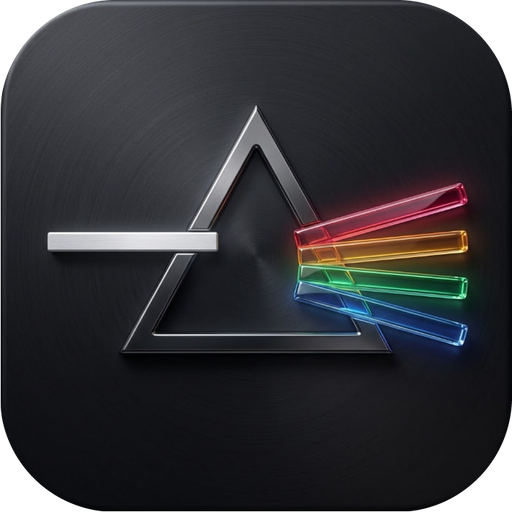

<div align="center">


# PrismStudio

**A fork of [Code - OSS](https://github.com/microsoft/vscode), with Claude in it.**

MIT licensed · not affiliated with or endorsed by Microsoft · see [NOTICE.md](NOTICE.md)
</div>

---

## What this is

PrismStudio is Visual Studio Code's open source core, rebranded and with a
Claude session built in. It is the editor you already know, because it is
literally the same source: this repository tracks
[microsoft/vscode](https://github.com/microsoft/vscode) and adds a small,
self-contained layer on top of it.

It is **not** Microsoft's Visual Studio Code, and it does not use Microsoft's
extension marketplace — read [NOTICE.md](NOTICE.md) for what that means in
practice, because it is the one thing worth knowing before you choose this
over the real thing.

## Claude

Claude is summoned, never resident. Nothing runs until you ask for it.

| | |
|---|---|
| `Ctrl+Shift+C` | open or close a Claude session, in the panel or as an editor tab |
| `Ctrl+Alt+A` | type a reference to the open file into Claude's prompt, unsent |
| `Ctrl+Alt+S` | the same for the current selection |

Pointing Claude at something types `@thatfile.ts line 40:` into its prompt and
leaves the cursor there. You finish the sentence and press return yourself:
nothing is sent anywhere on your behalf.

Settings live under `prismClaude` — the command to run, where it opens, and
whether it appears in the status bar.

## Building it

```sh
./branding/build.sh deps      # what the machine still needs
./branding/build.sh dev       # install, brand, compile
./prismstudio                 # run it
```

The build wants Node at the version in `.nvmrc` and about 6G of disk. If you
cannot install `libxkbfile-dev`, `libsecret-1-dev` and `libkrb5-dev` system
wide, `./branding/fetch-localdeps.sh` unpacks those headers into
`~/.local/prismdeps` and the build uses them from there, leaving your system
untouched.

`./branding/build.sh package` produces a distributable tree.

## Keeping up with upstream

Everything of ours is additive: `branding/`, `extensions/prism-claude/`, and
nothing else. The upstream tree is not edited, so:

```sh
git fetch upstream && git merge upstream/main
./branding/brand.py           # re-apply the branding afterwards
```

## Licence

MIT, as upstream. `LICENSE.txt` and `ThirdPartyNotices.txt` are unchanged. The
application icon is Hermes Foundry's own artwork and is excluded from that
grant.
