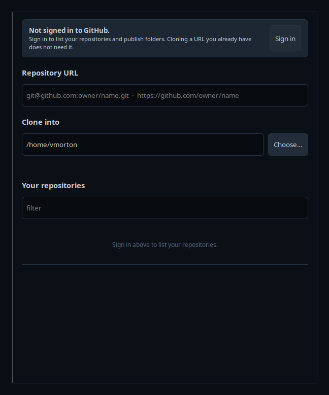
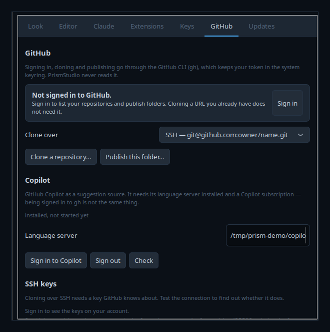
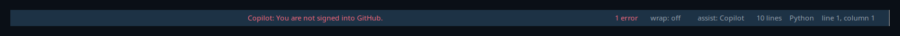

<div align="center">


# PrismStudio

**An editor with Claude beside it.**
GTK3, Python, native. No Electron, no browser, no telemetry.


<br>


</div>

---

## Install

One command. It checks what is missing, offers to install it, clones, sets it
up and opens it:

```sh
bash <(curl -fsSL https://raw.githubusercontent.com/HermesFoundry/PrismStudio/main/get.sh)
```

It asks before installing anything and before using `sudo`, and prints every
command before it runs it. `--dry-run` shows what it would do and changes
nothing; `--yes` skips the questions; `--dir PATH` puts it somewhere other than
`~/PrismStudio`. Read it first if you would rather —
[`get.sh`](get.sh) is a few hundred lines of shell and does nothing clever.

It knows the package names for apt, dnf, pacman, zypper and apk, and works out
what you are missing by importing it rather than by asking the package
database, which can be right while the import still fails.

<details>
<summary>Or do it yourself</summary>

```sh
git clone https://github.com/HermesFoundry/PrismStudio.git
cd PrismStudio && ./install.sh     # links `prism`, adds a desktop entry
prism .                            # open this folder
```

Nothing is compiled: it is Python, run from wherever you put it. `install.sh`
only puts it on your PATH and in the applications menu, and names whichever of
`python3-gi`, `gir1.2-vte-2.91` and `gir1.2-gtksource-4` is missing rather than
failing on an import.

On Debian and Ubuntu:

```sh
sudo apt install python3-gi python3-gi-cairo gir1.2-gtk-3.0 \
                 gir1.2-vte-2.91 gir1.2-gtksource-4 git
```

</details>

> **Linux only.** The terminal panel, the Claude session and the run bar are built
> on **VTE**, which spawns children on a Unix pseudoterminal. Windows has no
> equivalent and VTE has no port, so there is no native Windows build and no
> macOS one. On Windows, run it under **WSL2** — with WSLg it opens as an
> ordinary window and everything works, including the terminal.

| | |
|---|---|
| `prism` | reopen the folder you had last time |
| `prism .` · `prism ~/project` | open a folder |
| `prism a.py b.py` | open just those files |

---

## The window


Activity bar down the left switches the side bar between **Explorer**,
**Search**, **Run** and **Extensions**. The editor is the middle, with
breadcrumbs above it and a minimap down its right hand side. The terminal panel
lives underneath and the status bar runs along the bottom. Menus are in the
title bar where you reach for them, `Ctrl+B` hides the side bar, `Ctrl+J` the
panel, and every divider drags.

**It ships looking like the editor everyone already knows.** The default skin is
`vscode`, which is Dark+ to the hex — the same greys, the same blue status bar,
the same token colours — because a familiar window is one you do not have to
learn. Any of the other skins is one setting away, and a skin can now name its
own surfaces and token colours rather than having them mixed out of two, so a
palette copied from somewhere else stays exactly what it was copied from.

**Claude is summoned, not resident.** Nothing is on screen and no session is
running until you press `Ctrl+Shift+C`. By default it arrives **floating over
the editor** — Escape puts it away and nothing in the layout ever moves. If you
would rather dock it, it will also live as a tab in the bottom panel, as a pane
beside the editor, or in its own window on another monitor; moving between the
four keeps the running session, because it is a re-parent rather than a
restart. Preferences → Claude picks the place, and `CLAUDE=0` still removes
every Claude feature from the app.

**It opens empty.** A bare `prism` lists nothing on your machine — not even
the folder you had last time. The panel offers Open folder, Open file, Clone a
repository and your recent folders, and nothing else. Set `REOPEN_LAST=1` if
you would rather it picked up where you left off.

**Double-click the middle to start writing.** The empty state is a button: it
gives you an untitled document with the cursor already in it. `Ctrl+N` does
the same.

**It remembers within a folder.** Open one you have used before and the files
you had open come back, cursors where you left them. That is `RESTORE_SESSION`,
and it is separate from reopening the folder itself.


---

## Suggestions as you type


Dim text at the cursor showing what you are probably about to type. `Tab` takes
it, `Esc` drops it, `Alt+]` cycles, `Ctrl+Right` takes one word. It is painted
over the view, never inserted, so it cannot end up in your file or your undo
history by accident.

Two sources, and they are honestly different:

| source | where it comes from | how quick |
|:--|:--|:--|
| **file** | words and whole lines you already have open | instant, offline |
| **Claude** | the `claude` command, asked to fill in at the cursor | about ten seconds |
| **Copilot** | `@github/copilot-language-server`, if installed | under a second |

Ten seconds is not a per-keystroke completion and PrismStudio does not pretend
otherwise. The Claude tier runs **after you stop typing**, on a thread, and its
answer is dropped if you have moved on. The file tier is what makes typing feel
assisted; Claude is what gets a whole block right.

Switch source with the **assist:** button on the status bar, or
`Ctrl+Shift+space`.

---

## Claude working on the file with you


| you do | what happens |
|:--|:--|
| `Ctrl+I` | say what you want changed — Claude rewrites the selection and it lands as **one** `Ctrl+Z`, tinted so you can see it |
| `Ctrl+Alt+A` | opens Claude and types `@thatfile.js line 40:` into it, **unsent**, for you to finish |
| Claude edits a file on disk | the editor reloads it and highlights exactly what changed |

The open file is saved just before Claude reads it, so it never works from a
stale copy. That is why background autosave is **off** by default — nothing
rewrites your file until there is a reason to.

Nothing is sent anywhere on your behalf. Pointing Claude at a file types a
reference into its prompt and leaves the cursor there; you say what you want
and press return yourself.

---

## Run the app


Open a folder and the bar above the editor reads whatever manifests are in it.
**Install** runs the right command; **Run** starts it. When the thing you
started prints a localhost address, the bar reads it out of the terminal and
offers to open a browser there.

```
▶ Run   [ npm run dev ▾ ]   Node · npm    needs setup first     [Install packages]
■ Stop  [ npm run dev ▾ ]   Node · npm    http://localhost:4173  [Open in browser]
```

| it finds | it offers |
|:--|:--|
| `package.json` | every script, `dev` and `start` first, via npm / pnpm / yarn / bun |
| `manage.py` | Django's dev server, and migrate |
| Flask · FastAPI · Streamlit | the right dev server for each |
| `requirements.txt` · `pyproject.toml` | the install step, using the project's virtualenv if it has one |
| `Cargo.toml` · `go.mod` · `composer.json` · `Gemfile` | cargo, go, php, bundler |
| `docker-compose.yml` | `docker compose up` |
| `index.html` alone | a static server for the folder |
| a `Makefile` | its targets |

Everything runs in the terminal panel where you can see it, so output, prompts
and `Ctrl+C` behave exactly as if you had typed the command. **Stop** sends the
same `Ctrl+C`.

Two things it will not do. The package manager comes from the **lock file**, so
a `pnpm-lock.yaml` project never quietly gets `npm install` — that writes a
second lock file which fights the first. And a tool that is not installed is
reported with the reason instead of being substituted.

<div align="center">

<br><sub><i>…and the thing it was serving.</i></sub>
</div>

---

## Search the whole workspace


`Ctrl+Shift+F`, seeded with whatever you had selected. It uses **ripgrep** when
it is installed because it is enormously faster on a real tree, and falls back
to walking the folder in Python when it is not, so the feature never simply
disappears. `node_modules`, `.git`, `dist` and `__pycache__` are skipped
without being asked, and the search runs off the main loop so the window keeps
moving.

---

## Command palette and extensions

<table>
<tr>
<td width="50%"></td>
<td width="50%"></td>
</tr>
</table>

One box goes anywhere in the workspace. `Ctrl+P` opens it on the **files** in
the folder, fuzzy matched — `sdbt` finds `src/deep/buried_thing.py`. Type `>`
and it is the **command** list instead, every built-in and every extension
command, with the same loose matching: `hvcct` finds *Have Claude change this*.
Type `:` and a number to jump to a **line**. That list is what makes an
extension findable at all.

The file list is walked once in the background when you open a folder and kept,
so the box opens instantly in a large repository rather than counting it first.

An extension is a Python file in `~/.config/prismstudio/extensions` with a
`register(prism)` function:

```python
BLURB = "Says hello"

def register(prism):
    prism.command("hello", "Say hello", lambda: prism.status("hello"))
```

It can add commands, offer inline suggestions, and hook save and open. Install
one from **Settings → Extensions** (a file, a folder, or a git URL), toggle it
off, or remove it. A broken one is listed with its error and skipped — it
cannot stop the app from starting.

> They run in the editor's own process with your permissions. There is no
> sandbox. Read one before you install it.

Two worked examples and the full API: [`extensions/`](extensions/).

---

## GitHub, without leaving the editor

<table>
<tr>
<td width="50%"></td>
<td width="50%"></td>
</tr>
</table>

**Clone** (`Ctrl+Shift+P` → *Clone a repository*, or the button on an empty
Explorer) takes a URL, or lists your own repositories once you are signed in,
and works out the destination folder for you. It runs `git clone` **in the
terminal panel** where you can watch it, notices when it finishes, and offers
to open what arrived.

**Publish** puts the folder you have open on GitHub, sets `origin` and pushes,
also in the terminal. A repository with no remote says so in the Source
control panel and offers the button.

Signing in is `gh auth login`'s device flow, run in the terminal so you can see
the code and what it is asking for. **PrismStudio never handles your token**:
`gh` owns it and keeps it in the system keyring, and the only things read back
out are your account name, the host and the git protocol. There is no
`--show-token` anywhere in this codebase.

**SSH keys** are in **Settings → GitHub**: what is on your account, what is on
this machine, a button to make a new key, one to upload a `.pub`, and *Test the
connection*, which asks `github.com` whether it recognises you and tells you
what it said.

> Full VS Code style **Remote-SSH** — editing files on another machine — is not
> here. Cloning, publishing and pushing over SSH are.

---

## Copilot



`SUGGEST=copilot` used to be a setting with nothing behind it. Now it drives
[`@github/copilot-language-server`](https://www.npmjs.com/package/@github/copilot-language-server),
the same server the official editor plugins use:

```sh
npm install -g @github/copilot-language-server
```

Then cycle the **assist:** button, or `Ctrl+Shift+space`, until it reads
*Copilot*. Suggestions arrive as the same ghost text everything else uses,
`Tab` takes them, and acceptance is reported back so Copilot's own statistics
are not skewed by an editor that never says anything.

Sign in from **Settings → GitHub → Sign in to Copilot**: a device code, copied
to your clipboard, and a button that opens the page.

Copilot is a paid GitHub product. Being signed in to `gh` is **not** the same
as having a subscription, and the server says so plainly rather than going
quiet — a signed-out or unsubscribed account produces *not signed in to
Copilot* or *this GitHub account has no Copilot subscription* on the status
bar, never an empty suggestion you are left to interpret.

The source only appears in the cycle when the language server is actually
installed, so it is never possible to switch to a source that cannot answer.

---

## It tells you when there is a new one

<div align="center">

</div>

On the first launch after a release lands, a card says what changed. **Update
now** runs the update in the terminal panel where you can watch it, **Skip this
version** means never for that one, and **Later** means ask again tomorrow.

It asks one address for a few hundred bytes of JSON. The request carries
`User-Agent: PrismStudio/<version>` and nothing else: no identifier, no machine
details, nothing about what you have open. On disk it keeps the time of the
last check and the version you last skipped, in
`~/.cache/prismstudio/updates.json`. `UPDATE_CHECK=0` and it never opens a
socket. The check runs on a thread several seconds after the window is up, so
an unreachable server costs startup nothing.

**Settings → Updates** has the switch, the address, how often, and a
**Check now**. It is also `Ctrl+Shift+P` → *Check for updates*.

<details>
<summary>Publishing one</summary>

The manifest lives in git at
[`packaging/updates.json`](packaging/updates.json), so what the world is being
told sits next to the code that says it.

```sh
# once, on the server, as root — makes /var/www/prismstudio and serves it
sudo bash packaging/hermes-server-setup.sh

# then, per release, from here
./packaging/publish-update.py --version 1.1.0 \
    --note "Source control, the whole panel." \
    --note "Language servers for thirteen languages." \
    --important
```

`publish-update.py` refuses to announce a version that disagrees with
`VERSION` in `app/core.py`, refuses a release with no notes, parses the result
with the app's own parser, copies it into place in one move so nobody fetches
half a file, and then reads it back over the public address to prove clients
will see it.

</details>

---

## Skins


<div align="center"><sub>Nord · Olympus · Ember — seven ship, and Paper is light</sub></div>

The skin drives **everything**: window chrome, editor syntax colours, terminal
palette, ghost text, the run bar. Eleven colours in a shell-variable file, the
same format [Iris Terminal](https://github.com/HermesFoundry/iris-terminal)
uses, so a skin written for either works in both.

Drop more in `~/.config/prismstudio/themes/`, pick one in **Settings → Look**.

---

## Keys

| | |
|:--|:--|
| `Ctrl+K` · `Ctrl+O` · `Ctrl+N` | open folder · open file · new file |
| `Ctrl+S` · `Ctrl+Shift+S` | save · save as |
| `Ctrl+W` · `Ctrl+Tab` | close file · next file |
| `Ctrl+F` · `Ctrl+H` · `Ctrl+G` | find · replace · go to line |
| `Ctrl+Shift+F` | search the workspace |
| `Ctrl+Shift+G` | source control |
| `Ctrl+P` · `Ctrl+Shift+P` | go to file · command palette |
| `Ctrl+Tab` | back to the file you were just in |
| `Ctrl+B` · `Ctrl+J` · `Ctrl+Shift+C` | side bar · panel · open Claude |
| `Ctrl+Shift+B` · `Shift+F5` · `Ctrl+Shift+L` | run · stop · open in browser |
| `F5` | run just the open file |
| `Ctrl+space` · `Ctrl+Shift+space` | suggest here · change source |
| `Ctrl+I` · `Ctrl+Alt+A` | Claude change this · point Claude at this file |
| `Tab` · `Esc` · `Alt+]` · `Ctrl+Right` | take · drop · cycle · take a word |

Two presets — **standard** (what an editor user expects) and **reach** (the
same set moved off the plain control keys). Rebind anything in
**Settings → Keys**; it lands in `~/.config/prismstudio/keys.conf`.

---

## Settings

`~/.config/prismstudio/settings.conf`, shell-style `KEY=value`. Everything in
Settings writes here and applies immediately. Editing the file by hand keeps
your comments and ordering.

| | |
|:--|:--|
| `THEME` `FONT` `UI_FONT` | skin and type |
| `TAB_SIZE` `SPACES` `WRAP` `LINE_NUMBERS` `RIGHT_MARGIN` | the text |
| `SUGGEST` `SUGGEST_MODEL` `SUGGEST_DELAY` | inline suggestions |
| `AUTOSAVE` `FLUSH_FOR_CLAUDE` `TRIM_ON_SAVE` | saving |
| `SIDEBAR` `PANEL` `ASSISTANT` + sizes | layout |
| `GIT_PROTOCOL` `COPILOT_CMD` | GitHub and Copilot |
| `RESTORE_SESSION` `REOPEN_LAST` `CONFIRM_CLOSE` | on open and close |
| `CLAUDE_CMD` `SHELL` `EXTENSIONS` | what it runs |
| `UPDATE_CHECK` `UPDATE_URL` `UPDATE_INTERVAL` | looking for new versions |

---

## Checks

```sh
python3 tests/test_app.py         # window, workspace, session, panel, search
python3 tests/test_assist.py      # suggestions, ghost text, Claude's edits
python3 tests/test_extensions.py  # loading, isolation of a broken one, the palette
python3 tests/test_project.py     # what each kind of folder is detected as
python3 tests/test_runbar.py      # install, run, find the address, stop
python3 tests/test_lsp.py         # language servers: diagnostics, completion
python3 tests/test_claude.py      # where Claude opens, moving it, go-to-file
python3 tests/test_look.py        # named surfaces, breadcrumbs, minimap, guides
python3 tests/test_updates.py     # version compare, the throttle, staying quiet
python3 tests/test_github.py      # clone for real, publish, never touch a token
python3 tests/test_copilot.py     # the Copilot handshake, against the real server
```

**425 checks.** They assert on the widget tree and on real behaviour rather
than on pixels. `test_runbar.py` genuinely starts a server, fetches from it and
checks the port closes afterwards, because every interesting bug in that path
was a timing or integration bug a mock would have hidden.

Each starts its own headless display on its own port and uses a private
application id, so a running PrismStudio cannot answer for them, and each fails
if it somehow ran zero checks.

---

## Where things live

| what | where |
|:--|:--|
| window, layout, actions | `app/main.py` |
| settings, skins, colours | `app/core.py` · `app/styling.py` |
| editor, ghost text, suggestions | `app/editor.py` · `app/inline.py` · `app/assist.py` |
| tree, search, panel, Claude | `app/explorer.py` · `app/search.py` · `app/panel.py` · `app/assistant.py` |
| detecting and running a project | `app/project.py` · `app/runbar.py` · `app/runner.py` |
| extensions and the palette | `app/extensions.py` · `app/palette.py` |
| language servers, git, updates | `app/lsp.py` · `app/gitrepo.py` · `app/updates.py` |
| GitHub, cloning, Copilot | `app/github.py` · `app/clone.py` · `app/copilot.py` |
| skins | `themes/` |
| settings · shortcuts · extensions | `~/.config/prismstudio/` |
| session and recent folders | `~/.cache/prismstudio/state.json` |

---

## Licence and contributing

[MIT](LICENSE). PrismStudio bundles no third-party code — GTK, VTE and
GtkSourceView are imported through PyGObject at runtime and come from your
distribution. The application icon is not covered by the grant; it is the
project owner's artwork.

Issues and pull requests are welcome. There is no CI, so run the suites before
opening one — they are quick, they do not need the network except where they
say so, and each starts its own headless display on its own port so a running
PrismStudio cannot answer for them.

---

<div align="center">
<sub>

Grew out of the code view inside
**[Iris Terminal](https://github.com/HermesFoundry/iris-terminal)**.
They share the skin format and nothing else; neither needs the other.

</sub>
</div>
