<div align="center">


# PrismStudio

**An editor with Claude beside it.**
GTK3, Python, native. No Electron, no browser, no telemetry.


<br>

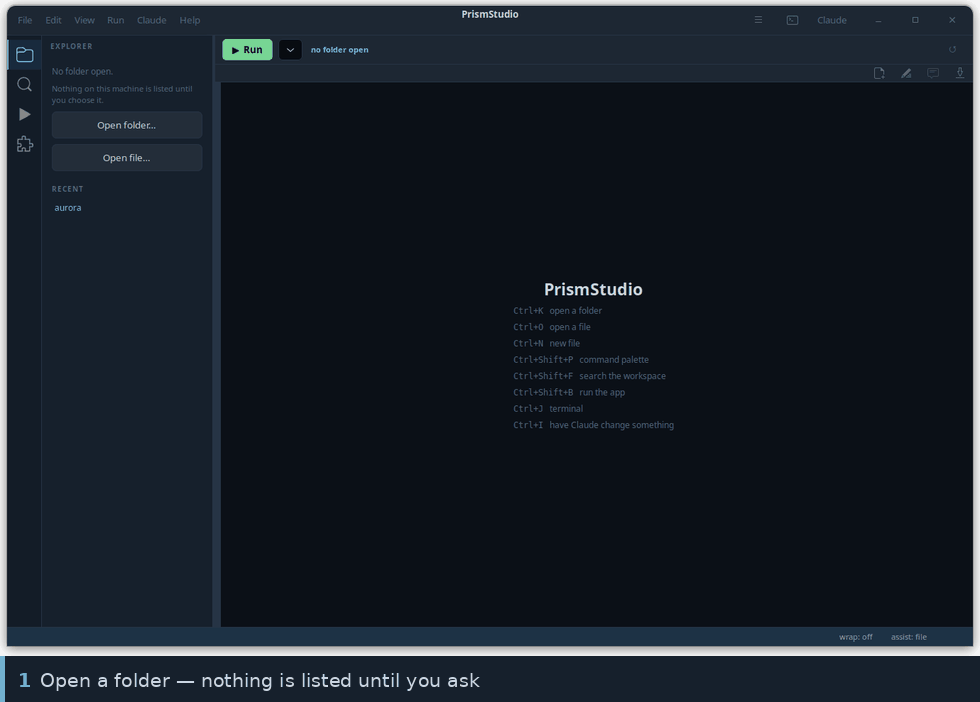

</div>

---

```sh
git clone git@github.com:HermesFoundry/PrismStudio.git
cd PrismStudio && ./install.sh     # links `prism`, adds a desktop entry
prism .                            # open this folder
```

`install.sh` tells you which of `python3-gi`, `gir1.2-vte-2.91` and
`gir1.2-gtksource-4` are missing rather than failing on import.

| | |
|---|---|
| `prism` | reopen the folder you had last time |
| `prism .` · `prism ~/project` | open a folder |
| `prism a.py b.py` | open just those files |

---

## The window

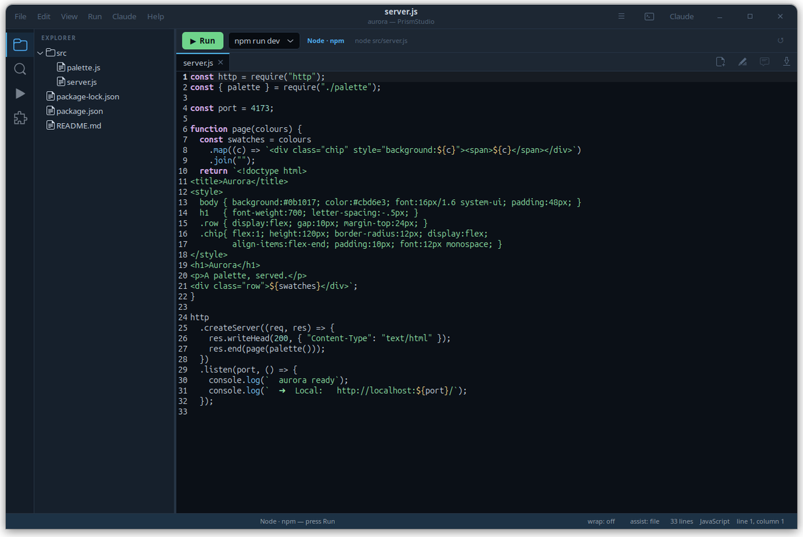

Activity bar down the left switches the side bar between **Explorer**,
**Search**, **Run** and **Extensions**. The editor is the middle. The terminal
panel lives underneath, Claude down the right, and a status bar along the
bottom. `Ctrl+B` hides the side bar, `Ctrl+J` the panel, `Ctrl+Shift+C` Claude.
Every divider drags.

**It opens empty.** Nothing on the machine is listed until you open a folder —
before that the panel offers Open folder, Open file and your recent folders,
and nothing else.

**It remembers.** Close it with four files open and it comes back with those
four files open, cursors where you left them, in the folder you were in.

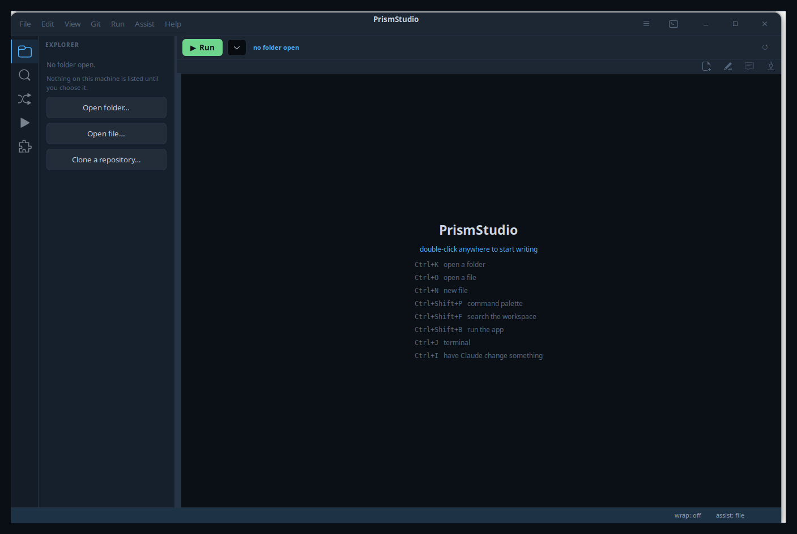

---

## Suggestions as you type

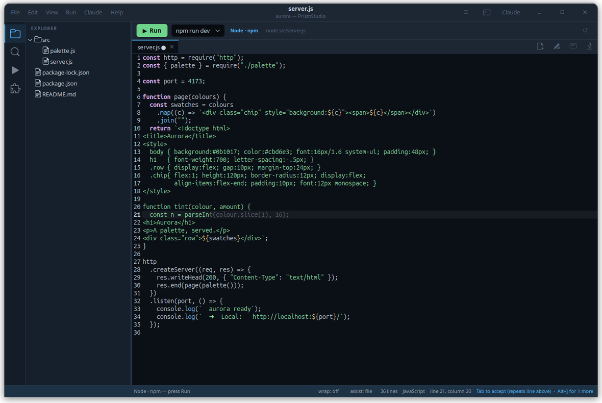

Dim text at the cursor showing what you are probably about to type. `Tab` takes
it, `Esc` drops it, `Alt+]` cycles, `Ctrl+Right` takes one word. It is painted
over the view, never inserted, so it cannot end up in your file or your undo
history by accident.

Two sources, and they are honestly different:

| source | where it comes from | how quick |
|:--|:--|:--|
| **file** | words and whole lines you already have open | instant, offline |
| **Claude** | the `claude` command, asked to fill in at the cursor | about ten seconds |

Ten seconds is not a per-keystroke completion and PrismStudio does not pretend
otherwise. The Claude tier runs **after you stop typing**, on a thread, and its
answer is dropped if you have moved on. The file tier is what makes typing feel
assisted; Claude is what gets a whole block right.

Switch source with the **assist:** button on the status bar, or
`Ctrl+Shift+space`.

---

## Claude working on the file with you

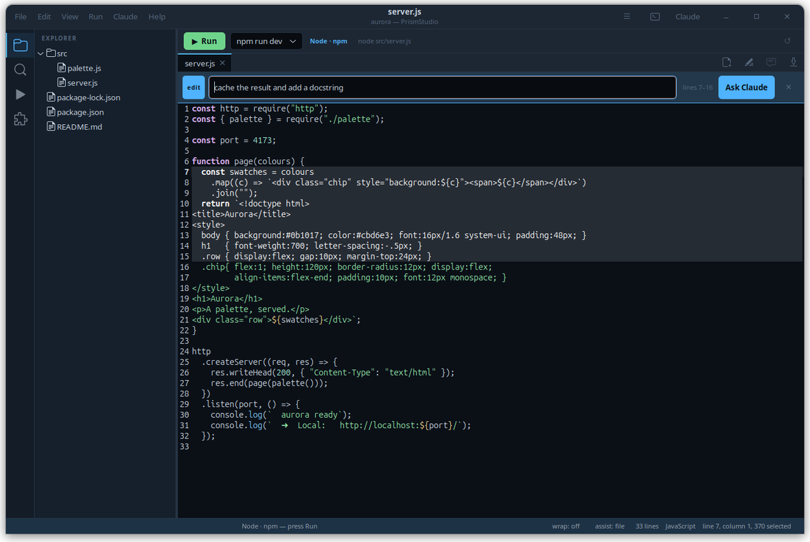

| you do | what happens |
|:--|:--|
| `Ctrl+I` | say what you want changed — Claude rewrites the selection and it lands as **one** `Ctrl+Z`, tinted so you can see it |
| `Ctrl+Alt+A` | types `@thatfile.js line 40:` into the Claude pane, **unsent**, for you to finish |
| Claude edits a file on disk | the editor reloads it and highlights exactly what changed |

The open file is saved just before Claude reads it, so it never works from a
stale copy. That is why background autosave is **off** by default — nothing
rewrites your file until there is a reason to.

Nothing is sent anywhere on your behalf. Pointing Claude at a file types a
reference into its prompt and leaves the cursor there; you say what you want
and press return yourself.

---

## Run the app

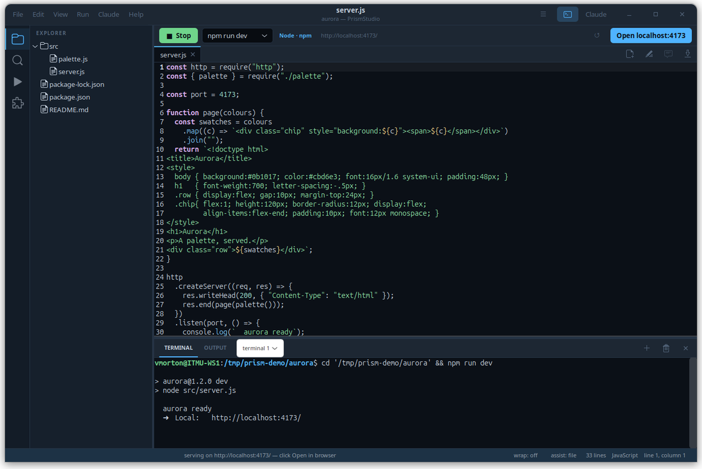

Open a folder and the bar above the editor reads whatever manifests are in it.
**Install** runs the right command; **Run** starts it. When the thing you
started prints a localhost address, the bar reads it out of the terminal and
offers to open a browser there.

```
▶ Run   [ npm run dev ▾ ]   Node · npm    needs setup first     [Install packages]
■ Stop  [ npm run dev ▾ ]   Node · npm    http://localhost:4173  [Open in browser]
```

| it finds | it offers |
|:--|:--|
| `package.json` | every script, `dev` and `start` first, via npm / pnpm / yarn / bun |
| `manage.py` | Django's dev server, and migrate |
| Flask · FastAPI · Streamlit | the right dev server for each |
| `requirements.txt` · `pyproject.toml` | the install step, using the project's virtualenv if it has one |
| `Cargo.toml` · `go.mod` · `composer.json` · `Gemfile` | cargo, go, php, bundler |
| `docker-compose.yml` | `docker compose up` |
| `index.html` alone | a static server for the folder |
| a `Makefile` | its targets |

Everything runs in the terminal panel where you can see it, so output, prompts
and `Ctrl+C` behave exactly as if you had typed the command. **Stop** sends the
same `Ctrl+C`.

Two things it will not do. The package manager comes from the **lock file**, so
a `pnpm-lock.yaml` project never quietly gets `npm install` — that writes a
second lock file which fights the first. And a tool that is not installed is
reported with the reason instead of being substituted.

<div align="center">
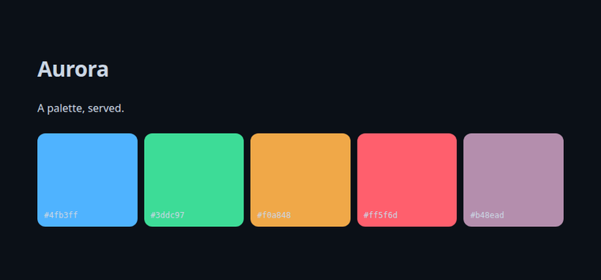
<br><sub><i>…and the thing it was serving.</i></sub>
</div>

---

## Search the whole workspace

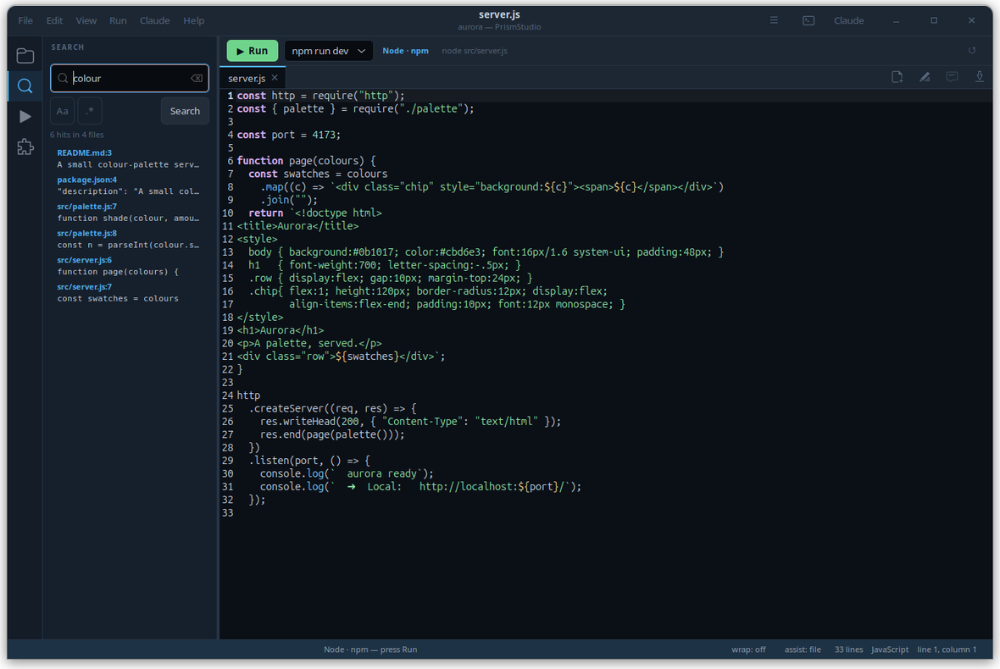

`Ctrl+Shift+F`, seeded with whatever you had selected. It uses **ripgrep** when
it is installed because it is enormously faster on a real tree, and falls back
to walking the folder in Python when it is not, so the feature never simply
disappears. `node_modules`, `.git`, `dist` and `__pycache__` are skipped
without being asked, and the search runs off the main loop so the window keeps
moving.

---

## Command palette and extensions

<table>
<tr>
<td width="50%">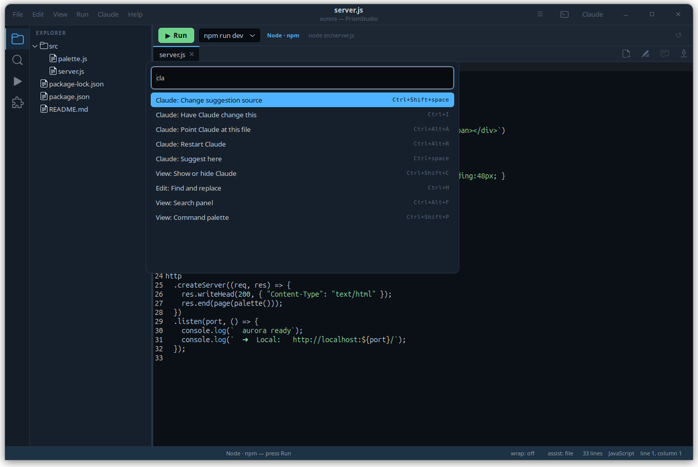</td>
<td width="50%">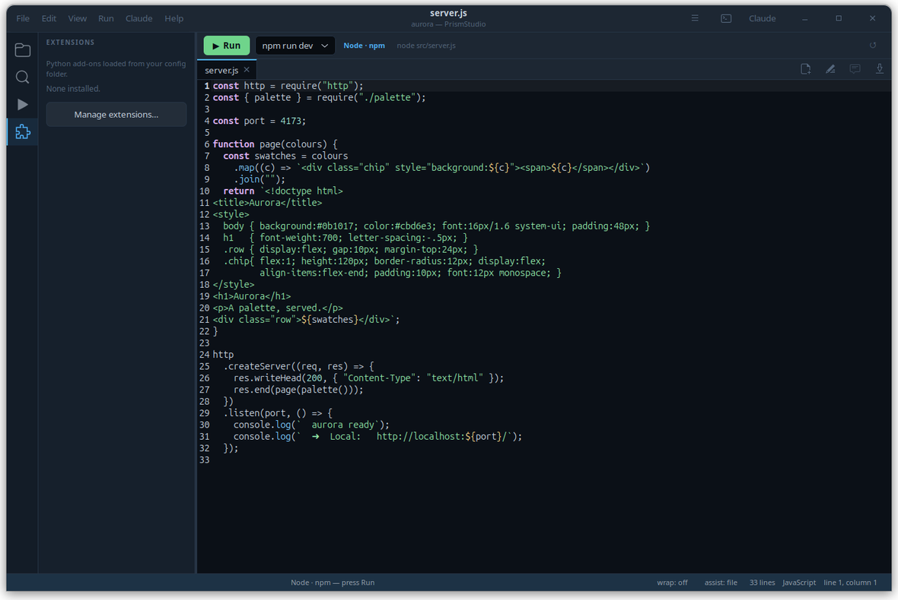</td>
</tr>
</table>

`Ctrl+Shift+P` puts every built-in command and every extension command in one
searchable list, with loose subsequence matching — `hvcct` finds *Have Claude
change this*. That list is what makes an extension findable at all.

An extension is a Python file in `~/.config/prismstudio/extensions` with a
`register(prism)` function:

```python
BLURB = "Says hello"

def register(prism):
    prism.command("hello", "Say hello", lambda: prism.status("hello"))
```

It can add commands, offer inline suggestions, and hook save and open. Install
one from **Settings → Extensions** (a file, a folder, or a git URL), toggle it
off, or remove it. A broken one is listed with its error and skipped — it
cannot stop the app from starting.

> They run in the editor's own process with your permissions. There is no
> sandbox. Read one before you install it.

Two worked examples and the full API: [`extensions/`](extensions/).

---

## It tells you when there is a new one

<div align="center">
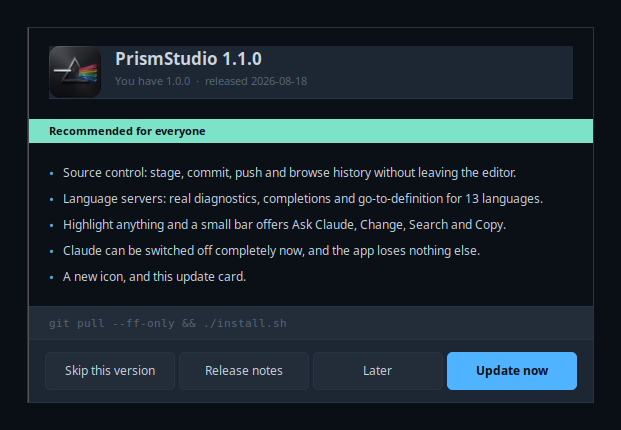
</div>

On the first launch after a release lands, a card says what changed. **Update
now** runs the update in the terminal panel where you can watch it, **Skip this
version** means never for that one, and **Later** means ask again tomorrow.

It asks one address for a few hundred bytes of JSON. The request carries
`User-Agent: PrismStudio/<version>` and nothing else: no identifier, no machine
details, nothing about what you have open. On disk it keeps the time of the
last check and the version you last skipped, in
`~/.cache/prismstudio/updates.json`. `UPDATE_CHECK=0` and it never opens a
socket. The check runs on a thread several seconds after the window is up, so
an unreachable server costs startup nothing.

**Settings → Updates** has the switch, the address, how often, and a
**Check now**. It is also `Ctrl+Shift+P` → *Check for updates*.

<details>
<summary>Publishing one</summary>

The manifest lives in git at
[`packaging/updates.json`](packaging/updates.json), so what the world is being
told sits next to the code that says it.

```sh
# once, on the server, as root — makes /var/www/prismstudio and serves it
sudo bash packaging/hermes-server-setup.sh

# then, per release, from here
./packaging/publish-update.py --version 1.1.0 \
    --note "Source control, the whole panel." \
    --note "Language servers for thirteen languages." \
    --important
```

`publish-update.py` refuses to announce a version that disagrees with
`VERSION` in `app/core.py`, refuses a release with no notes, parses the result
with the app's own parser, copies it into place in one move so nobody fetches
half a file, and then reads it back over the public address to prove clients
will see it.

</details>

---

## Skins

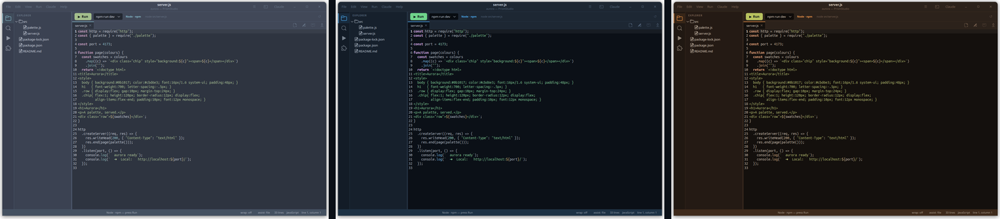
<div align="center"><sub>Nord · Olympus · Ember — seven ship, and Paper is light</sub></div>

The skin drives **everything**: window chrome, editor syntax colours, terminal
palette, ghost text, the run bar. Eleven colours in a shell-variable file, the
same format [Iris Terminal](https://github.com/HermesFoundry/iris-terminal)
uses, so a skin written for either works in both.

Drop more in `~/.config/prismstudio/themes/`, pick one in **Settings → Look**.

---

## Keys

| | |
|:--|:--|
| `Ctrl+K` · `Ctrl+O` · `Ctrl+N` | open folder · open file · new file |
| `Ctrl+S` · `Ctrl+Shift+S` | save · save as |
| `Ctrl+W` · `Ctrl+Tab` | close file · next file |
| `Ctrl+F` · `Ctrl+H` · `Ctrl+G` | find · replace · go to line |
| `Ctrl+Shift+F` | search the workspace |
| `Ctrl+Shift+G` | source control |
| `Ctrl+Shift+P` | command palette |
| `Ctrl+B` · `Ctrl+J` · `Ctrl+Shift+C` | side bar · panel · Claude |
| `Ctrl+Shift+B` · `Shift+F5` · `Ctrl+Shift+L` | run · stop · open in browser |
| `F5` | run just the open file |
| `Ctrl+space` · `Ctrl+Shift+space` | suggest here · change source |
| `Ctrl+I` · `Ctrl+Alt+A` | Claude change this · point Claude at this file |
| `Tab` · `Esc` · `Alt+]` · `Ctrl+Right` | take · drop · cycle · take a word |

Two presets — **standard** (what an editor user expects) and **reach** (the
same set moved off the plain control keys). Rebind anything in
**Settings → Keys**; it lands in `~/.config/prismstudio/keys.conf`.

---

## Settings

`~/.config/prismstudio/settings.conf`, shell-style `KEY=value`. Everything in
Settings writes here and applies immediately. Editing the file by hand keeps
your comments and ordering.

| | |
|:--|:--|
| `THEME` `FONT` `UI_FONT` | skin and type |
| `TAB_SIZE` `SPACES` `WRAP` `LINE_NUMBERS` `RIGHT_MARGIN` | the text |
| `SUGGEST` `SUGGEST_MODEL` `SUGGEST_DELAY` | inline suggestions |
| `AUTOSAVE` `FLUSH_FOR_CLAUDE` `TRIM_ON_SAVE` | saving |
| `SIDEBAR` `PANEL` `ASSISTANT` + sizes | layout |
| `RESTORE_SESSION` `CONFIRM_CLOSE` | on open and close |
| `CLAUDE_CMD` `SHELL` `EXTENSIONS` | what it runs |
| `UPDATE_CHECK` `UPDATE_URL` `UPDATE_INTERVAL` | looking for new versions |

---

## Checks

```sh
python3 tests/test_app.py         # window, workspace, session, panel, search
python3 tests/test_assist.py      # suggestions, ghost text, Claude's edits
python3 tests/test_extensions.py  # loading, isolation of a broken one, the palette
python3 tests/test_project.py     # what each kind of folder is detected as
python3 tests/test_runbar.py      # install, run, find the address, stop
python3 tests/test_lsp.py         # language servers: diagnostics, completion
python3 tests/test_updates.py     # version compare, the throttle, staying quiet
```

**357 checks.** They assert on the widget tree and on real behaviour rather
than on pixels. `test_runbar.py` genuinely starts a server, fetches from it and
checks the port closes afterwards, because every interesting bug in that path
was a timing or integration bug a mock would have hidden.

Each starts its own headless display on its own port and uses a private
application id, so a running PrismStudio cannot answer for them, and each fails
if it somehow ran zero checks.

---

## Where things live

| what | where |
|:--|:--|
| window, layout, actions | `app/main.py` |
| settings, skins, colours | `app/core.py` · `app/styling.py` |
| editor, ghost text, suggestions | `app/editor.py` · `app/inline.py` · `app/assist.py` |
| tree, search, panel, Claude | `app/explorer.py` · `app/search.py` · `app/panel.py` · `app/assistant.py` |
| detecting and running a project | `app/project.py` · `app/runbar.py` · `app/runner.py` |
| extensions and the palette | `app/extensions.py` · `app/palette.py` |
| language servers, git, updates | `app/lsp.py` · `app/gitrepo.py` · `app/updates.py` |
| skins | `themes/` |
| settings · shortcuts · extensions | `~/.config/prismstudio/` |
| session and recent folders | `~/.cache/prismstudio/state.json` |

---

<div align="center">
<sub>

Grew out of the code view inside
**[Iris Terminal](https://github.com/HermesFoundry/iris-terminal)**.
They share the skin format and nothing else; neither needs the other.

</sub>
</div>
